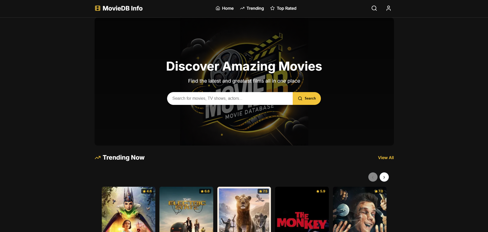
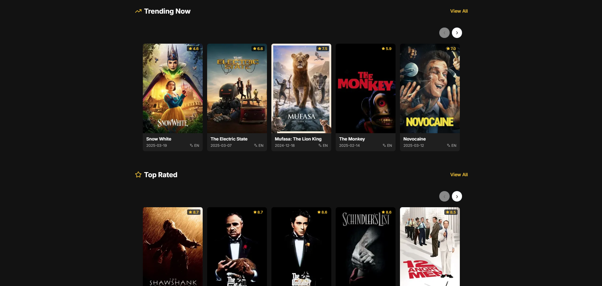
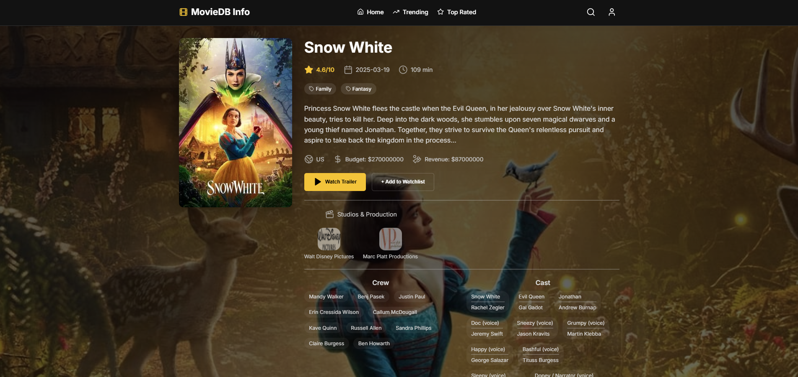
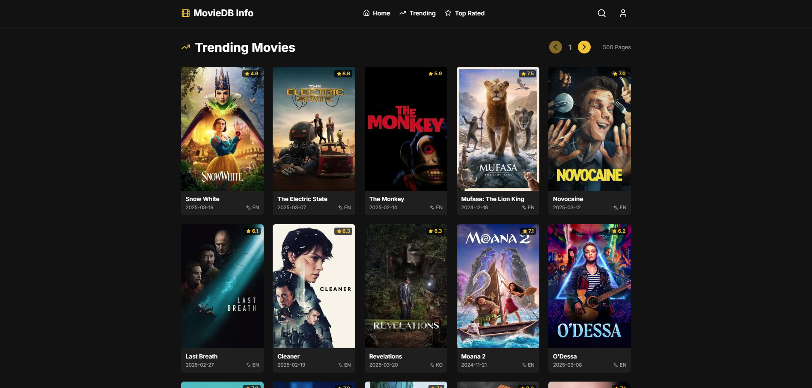
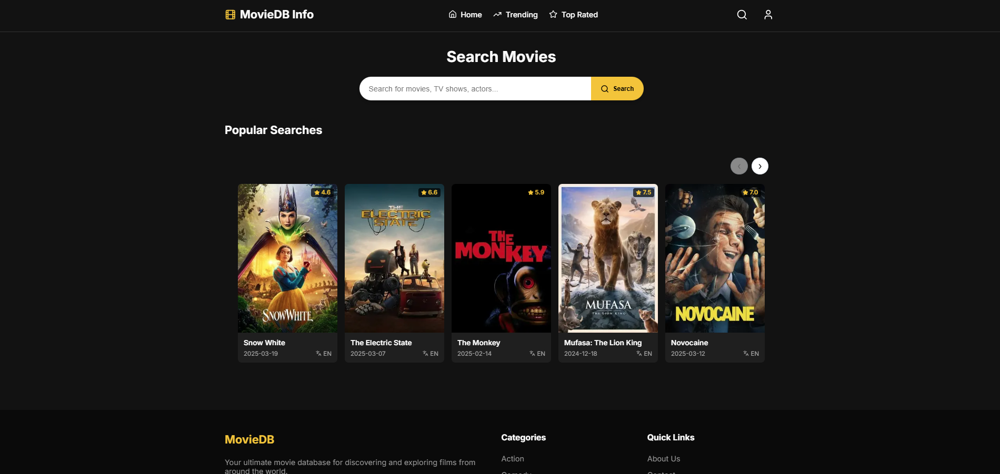
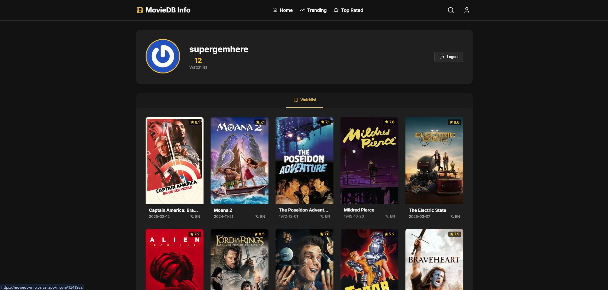
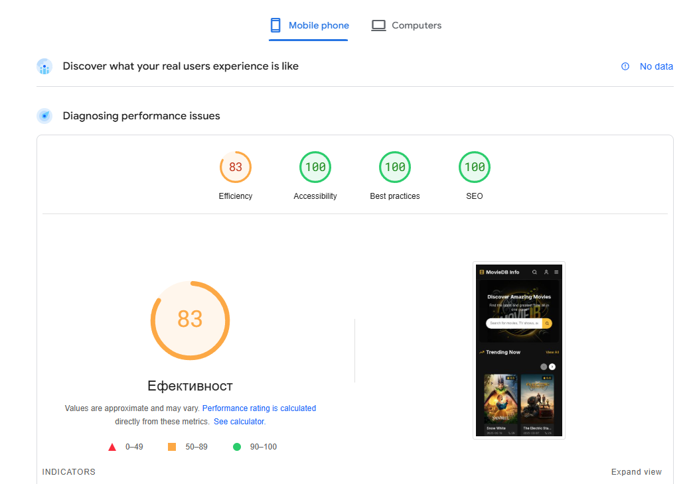
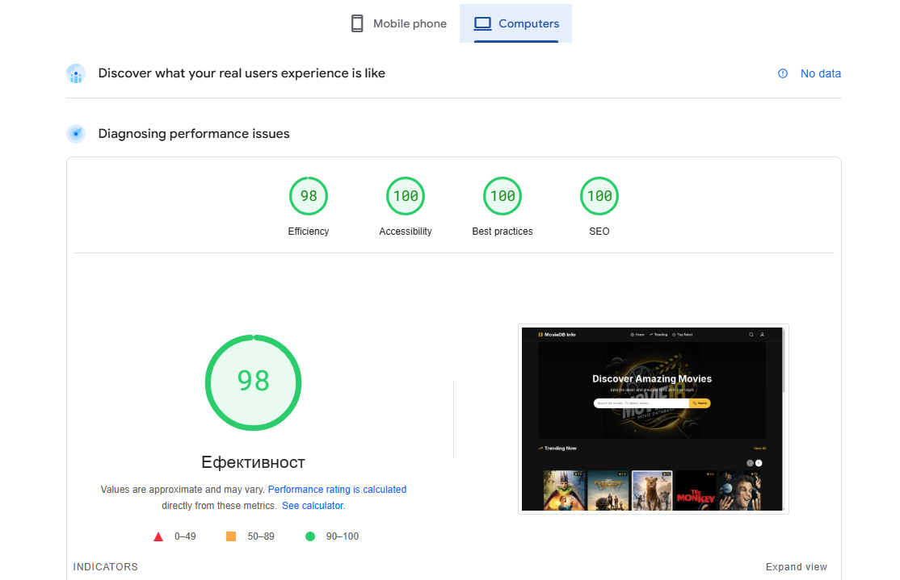

# MovieDB Info
This is a project made for my portfolio and It's made with learning purpose of Next.js and SEO.








MovieDB is a modern movie catalog platform specializing in showing details for a wide range of movie titles using TMDB API. It offers users a seamless browsing experience, from newly released movies to classic titles.

## Google Page Insights




This site was built to production using [Vercel](https://vercel.com/).

Live Demo - [MovieDB Info](https://moviedb-info.vercel.app/).

## Features

- 🛍️ **Movie Catalog**: Browse through an extensive movie catalog with detailed movie pages, including plot, cast, ratings, and release dates
- 🔍 **Advanced Search**: Find movies by title.
- 🛒 **Watchlist**: Save your favorite movies and access them anytime.
- 📱 **Responsive Design**: Optimized for all devices.
- 🔐 **User Authentication**: Secure login and registration system trough TMDB OAuth API.
- 🔎 **SEO Friendly**: Google SEO friendly, ranking 3-rd on search on Chrome.

## Technologies Used

### Frontend
- React.js
- Next.js
- TypeScript
- TMDB API & TMDB OAuth Flow
- HTML5 & CSS3
- ContextAPI
- Axios
- Lucide-react
- MUI Icons


### Other Tools
- Git/GitHub
- Next CLI 

## Installation Client

1. Clone the repository:
   ```bash
   git clone https://github.com/superGemHere/MovieDB.git
   ```
2. Navigate to the client directory:
   ```bash
   cd moviedb
   ```
3. Install dependencies:
   ```bash
   npm install
   ```
4. Set up environment variables, for development server:
   ```
   NEXT_PUBLIC_TMDB_API_KEY="YOUR_TMDB_API_KEY"

   ```
5. Start the development server:
   ```bash
   npm run dev
   ```